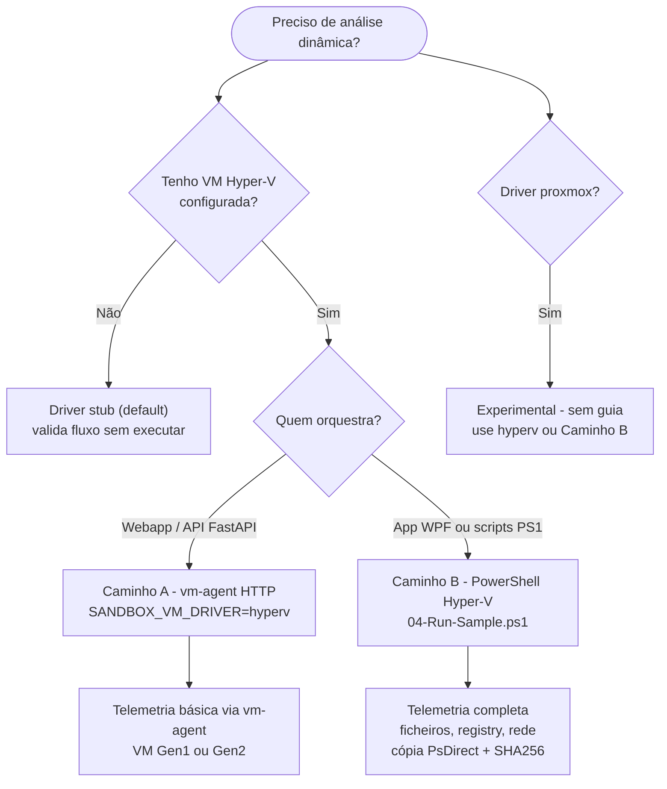

# RAT Analyzer

Plataforma integrada para triagem e análise de malware: deteção de **RATs (Remote Access Trojans)** com
**análise estática**, **regras YARA**, **scoring de risco** e **análise comportamental** em sandbox de VM
isolada — num único fluxo operacional (web, API ou desktop).

> Projeto desenvolvido no âmbito de uma **licenciatura**. Visa também ser uma ferramenta **educativa** de
> análise de malware: além de detetar, explica o que cada função suspeita parece fazer.

---

## Índice

- [Visão geral](#visão-geral)
- [Arquitetura e componentes](#arquitetura-e-componentes)
- [Estrutura do repositório](#estrutura-do-repositório)
- [Início rápido](#início-rápido)
- [Segurança e configuração](#segurança-e-configuração) · [`docs/SEGURANCA.md`](docs/SEGURANCA.md)
- [Testes e CI](#testes-e-ci)
- [Módulos de análise](#módulos-de-análise)
- [Scoring de risco](#scoring-de-risco)
- [Análise dinâmica (sandbox)](#análise-dinâmica-sandbox)
- [Documentação](#documentação)
- [Limitações e roadmap](#limitações-e-roadmap)
- [Licença](#licença)

---

## Visão geral

O fluxo é **integrado**: o utilizador arrasta um ficheiro, escolhe o tipo de análise e
recebe relatórios detalhados a partir de um único ecossistema de ferramentas.

1. **Arrastar** um ficheiro (`.exe`, `.dll`, `.cs`, etc.) para a interface (web ou desktop WPF).
2. **Escolher** o tipo de análise: **Estática**, **Dinâmica** ou **Ambas**.
3. **Consultar** os resultados: código descompilado (C#/pseudo-C), relatório estático, relatório
   comportamental da VM, scores e indicadores, com explicações assistidas por IA.

| Fluxo | O que faz |
|-------|-----------|
| **Estático** | Descompila o binário (ILSpy/Ghidra), analisa imports/strings/YARA/evasão e gera relatório + score, destacando funções potencialmente maliciosas. |
| **Dinâmico** | Cria/reativa uma VM sandbox isolada (a partir de snapshot limpo), executa a amostra com timeout, monitoriza comportamento (processos, ficheiros, registry, rede) e devolve o relatório comportamental. |

---

## Arquitetura e componentes

| Componente | Pasta | Stack | Descrição |
|------------|-------|-------|-----------|
| **Backend** | [`backend/`](backend/README.md) | Python · FastAPI | API e pipeline de análise (estática + orquestração da dinâmica). |
| **Frontend** | [`frontend/`](frontend/README.md) | React · Vite · TS | Interface web *Drop & Analyze* (upload, relatórios, pseudo-C, IL, xrefs). |
| **Desktop** | [`wpf-gui/`](wpf-gui/README.md) | .NET 8 · WPF | App `RatAnalyzer.Desktop`: ponto de entrada gráfico, bootstrap de dependências e VM. |
| **GUI Tkinter** *(opcional)* | [`backend/gui/`](backend/gui/README.md) | Python · Tkinter | Interface gráfica leve: arrastar `.cs`/`.exe` sem Node nem WPF. |
| **VM Agent** | [`vm-agent/`](vm-agent/README.md) | .NET 8 · Minimal API | Agent HTTP que corre dentro da VM sandbox (upload/run/report). |
| **Teste benigno** | [`benign-vm-test/`](benign-vm-test/README.md) | .NET 8 | Programa inofensivo para validar o pipeline da VM. |
| **Exemplos .NET** *(opcional)* | [`programa/`](programa/README.md) | C# | Projetos de exemplo para testes manuais e fluxo *arrastar .cs → compilar*. |
| **Sandbox Hyper-V** | [`scripts/hyperv-sandbox/`](scripts/hyperv-sandbox/README.md) | PowerShell | Automação Hyper-V: cria VM, executa amostra e copia relatório (PsDirect + SHA256). |
| **Regras YARA** | [`yara_rules/`](yara_rules/README.md) | YARA | Assinaturas carregadas pelo scanner. |
| **Documentação** | [`docs/`](docs/README.md) | Markdown · PUML | Guias, especificações e diagramas. |

## Estrutura do repositório

```
PROJETO/
├── backend/                 # API FastAPI + pipeline de análise (Python)
│   ├── api.py               #   Endpoints /api/analyze, /api/analyze_stream, /api/analysis
│   ├── analysis_jobs.py     #   Jobs static | dynamic | both
│   ├── config.py            #   Configuração central (paths, DB, DATA_DIR)
│   ├── vm_orchestrator.py   #   Orquestração da análise dinâmica (escolhe driver)
│   ├── modules/             #   Analisadores (static, yara, deobfuscator, decompilers, scoring…)
│   ├── vm_drivers/          #   Drivers dinâmicos (stub, hyperv, proxmox)
│   ├── gui/                 #   GUI Tkinter opcional - ver backend/gui/README.md
│   └── tests/               #   Testes (pytest)
├── frontend/                # Interface web React/Vite
├── wpf-gui/                 # App desktop WPF (.NET 8) - ver wpf-gui/README.md
├── vm-agent/                # Agent HTTP (.NET 8) na VM - ver vm-agent/README.md
├── benign-vm-test/          # Programa .NET benigno + BenignVmTest.Tests (xUnit)
├── programa/                # Projetos .NET de exemplo (MeuExemplo na solução)
│   └── MeuExemplo/
├── scripts/hyperv-sandbox/  # Automação PowerShell Hyper-V (scripts numerados 00-07)
├── yara_rules/              # Regras YARA (.yar)
├── docs/                    # Documentação, especificações e diagramas PUML
├── relatório/               # LaTeX académico — ver relatório/README.md
├── RatAnalyzer.sln          # Solução .NET (WPF, vm-agent, benign-vm-test, MeuExemplo)
└── README.md
```

> **Artefatos de runtime** (jobs, base de dados SQLite, `reports/`, decompilados) **não** ficam no
> repositório: são guardados sob `DATA_DIR` (por defeito `%LOCALAPPDATA%\RatAnalyzer`, com override via
> `RATANALYZER_DATA_DIR`). A pasta `decompiled/` na raiz do repo, se existir, é legado - ver `backend/config.py`.

---

## Início rápido

### Pré-requisitos

- **Python 3.10+** (backend e CLI)
- **Node.js 18+** e **npm** (frontend)
- **.NET 8 SDK** (desktop WPF, VM agent) - opcional
- **YARA** instalado no sistema (para o scanner) - [releases](https://github.com/VirusTotal/yara/releases)
- **Ghidra 12+** + `GHIDRA_INSTALL_DIR` (pseudo-C de binários nativos) - opcional

### Interface web (recomendado)

```bash
# 1) Backend (API FastAPI) - recomendado bind local
cd backend
pip install --require-hashes -r requirements.lock
uvicorn api:app --reload --host 127.0.0.1 --port 8000

# 2) Frontend (noutro terminal) - Vite na porta 8080
cd frontend
npm i
npm run dev
```

Abra **http://localhost:8080** e arraste ficheiros para analisar. Detalhes em [`frontend/README.md`](frontend/README.md).

### CLI (análise estática rápida)

```bash
cd backend
python rat_analyzer.py caminho/para/ficheiro.exe -o reports/ -v
```

| Parâmetro | Descrição |
|-----------|-----------|
| `file` | Caminho do `.exe`/`.dll` a analisar (obrigatório) |
| `-o, --output` | Diretório de saída dos relatórios (padrão: `reports`) |
| `-v, --verbose` | Modo verboso |

### Aplicação desktop WPF e projetos .NET

Todos os projetos .NET (`wpf-gui`, `vm-agent`, `benign-vm-test`) estão na solução `RatAnalyzer.sln`:

```powershell
# Compilar tudo
dotnet build RatAnalyzer.sln -c Release

# Executar a app desktop
dotnet run --project wpf-gui
```

Lance a app a partir da raiz do repositório (ou com `backend/` e `frontend/` resolvíveis em relação ao exe).

### Limpar caches e artefatos

```bash
python backend/clean.py           # use --dry-run para simular
```

Remove caches e artefatos gerados (`__pycache__/`, `.pytest_cache`, `*.pyc`, `programa/**/bin|obj`,
decompilados em `DATA_DIR` e legado `decompiled/` na raiz); **não** apaga código fonte nem relatórios
em `DATA_DIR/reports/`.

---

## Segurança e configuração

> **Contexto académico / laboratório.** Em produção, configure autenticação, bind local ou reverse proxy com TLS, e isolamento da sandbox antes de expor serviços à rede.

**Arquitetura de segurança (estrutura completa):** [`docs/SEGURANCA.md`](docs/SEGURANCA.md) - zonas de confiança, auth por componente, uploads, sandbox e checklist.

**Produção:** gere segredos com `.\scripts\generate-production-secrets.ps1` e siga [`docs/production-secrets.md`](docs/production-secrets.md). Com `RATANALYZER_ENV=production` ou `RATANALYZER_REQUIRE_API_TOKEN=1`, o backend exige `RATANALYZER_API_TOKEN` no arranque.

| Variável | Componente | Descrição |
|----------|------------|-----------|
| `RATANALYZER_API_TOKEN` | Backend / WPF / frontend | Se definido, **todos** os endpoints de upload (`/api/analyze`, `/api/analysis`, storage) exigem header `X-API-Token`. No frontend use `VITE_API_TOKEN`. |
| `RATANALYZER_MAX_UPLOAD_MB` | Backend | Limite de upload (default **100** MB). |
| `RATANALYZER_MAX_WORKERS` | Backend | Workers de análise em paralelo (default **2**). |
| `RATANALYZER_CORS_ORIGINS` | Backend | Origens CORS permitidas (default inclui `localhost:8080`). |
| `VM_AGENT_TOKEN` | vm-agent + backend | **Obrigatório** no arranque do agent (exceto dev com `VM_AGENT_ALLOW_INSECURE=1`). Header `X-Agent-Token`. |
| `PROJETOVM_GuestPassword` | Scripts Hyper-V | **Obrigatório** (exceto dev com `PROJETOVM_ALLOW_INSECURE_DEFAULTS=1`). |
| `PROJETOVM_BasePath` | Scripts Hyper-V / WPF | Pasta raiz do sandbox (default `D:\PROJETOVM`). |

**Pipelines dinâmicas:** ver [`docs/README.md`](docs/README.md#análise-dinâmica--qual-caminho-usar). Segredos: [`docs/production-secrets.md`](docs/production-secrets.md). Estrutura: [`docs/SEGURANCA.md`](docs/SEGURANCA.md).

---

## Testes e CI

Comandos e convenções: [`CONTRIBUTING.md`](CONTRIBUTING.md). CI: [`.github/workflows/ci.yml`](.github/workflows/ci.yml) (66 pytest · 37 Vitest · 48 xUnit · PowerShell UTF-8 · diagramas).

---

## Módulos de análise

Todos os analisadores estão em `backend/modules/` - ver [README do backend](backend/README.md#estrutura). Resumo:

| Módulo | Função |
|--------|--------|
| **Static Analyzer** | Imports/funções suspeitas, strings C&C, evasão (anti-debug/anti-VM), entropia e packers em ficheiros PE (sem executar). |
| **YARA Scanner** | Compila e aplica regras YARA (`yara_rules/`) para padrões de RATs e C&C. |
| **Deobfuscator** | Deteta strings XOR, descodifica Base64 e identifica indicadores de ofuscação. |
| **Decompilers** | `dotnet_decompiler` (ILSpy) e `ghidra_decompiler` para pseudo-C de binários nativos. |
| **Risk Scorer** | Calcula o score de risco agregado (ver abaixo). |
| **Report Generator** | Produz o relatório final detalhado. |

### Personalização

- **Adicionar regras YARA**: coloque ficheiros `.yar` em `yara_rules/` (compilação automática).
- **Ajustar pesos do score**: edite `backend/modules/risk_scorer.py`.
- **Padrões de deteção**: edite `SUSPICIOUS_IMPORTS`, `SUSPICIOUS_FUNCTIONS` e `C2_PATTERNS` em
  `backend/modules/static_analyzer.py`.

## Scoring de risco

O score (0-100) agrega múltiplos fatores:

| Fator | Peso | | Fator | Peso |
|-------|:----:|-|-------|:----:|
| Strings C&C | 20 | | Persistência | 10 |
| Matches YARA | 20 | | Packer | 10 |
| Funções suspeitas | 18 | | Ofuscação | 10 |
| Imports suspeitos | 15 | | Entropia alta | 5 |
| Indicadores de stealer | 15 | | | |
| Técnicas de evasão | 15 | | | |

**Níveis:** `80-100` CRÍTICO · `60-79` ALTO · `40-59` MÉDIO · `20-39` BAIXO · `0-19` MUITO BAIXO

---

## Análise dinâmica (sandbox)

VM isolada (sem internet), snapshot limpo. Dois caminhos independentes - **tabela de escolha e guias:** [`docs/README.md`](docs/README.md#análise-dinâmica--qual-caminho-usar).



- **Caminho A** - backend + vm-agent HTTP (`SANDBOX_VM_DRIVER=hyperv`; default `stub` não executa amostras).
- **Caminho B** - WPF / `04-Run-Sample.ps1` (telemetria comportamental completa).

FAQ: [`docs/faq.md`](docs/faq.md) · diagnóstico Caminho B: [`scripts/hyperv-sandbox/TROUBLESHOOTING.md`](scripts/hyperv-sandbox/TROUBLESHOOTING.md).

---

## Documentação

**Índice completo:** [`docs/README.md`](docs/README.md) · [`CONTRIBUTING.md`](CONTRIBUTING.md) · relatório académico [`relatório/main.tex`](relatório/main.tex) (co-localizado com o código; diagramas fonte em `docs/diagrams/`).

---

## Limitações e roadmap

**Limitações**
- A análise dinâmica depende de infraestrutura de sandbox (VM + vm-agent ou pipeline Hyper-V + configuração).
- O driver `stub` (default) não executa o ficheiro; valida apenas o fluxo end-to-end.
- A deobfuscação é básica; as regras YARA v2 são heurísticas educativas (confirmar com análise estática/dinâmica).
- Afinamento fino das regras YARA por família de malware requer amostras reais no laboratório.

**Roadmap**
- [x] Explicações assistidas por IA no frontend (Google Gemini - opcional, client-side)
- [ ] Integração com IDA (Ghidra já integrado)
- [ ] Deobfuscação avançada
- [ ] Telemetria dinâmica avançada no vm-agent (Sysmon/ETW/hooking) e enriquecimento de `dynamicReport`
- [ ] Suporte a mais formatos de ficheiro
- [ ] Base de dados de assinaturas de malware conhecido
- [ ] Análise de rede (tráfego C&C)

---

## Licença

[MIT](LICENSE) — projeto desenvolvido no âmbito académico (licenciatura). Sugestões e melhorias são bem-vindas — ver [`CONTRIBUTING.md`](CONTRIBUTING.md).
