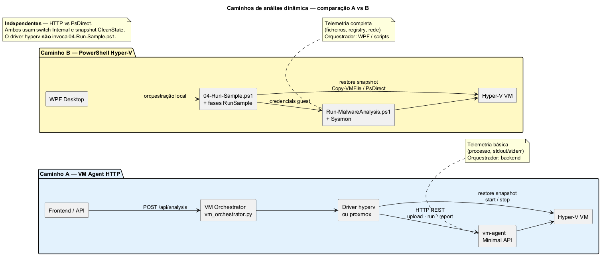

# Documentação - RAT Analyzer

Índice técnico. Visão geral e início rápido: [README principal](../README.md).

## Análise dinâmica - qual caminho usar?

| Quer… | Caminho | Orquestrador | Documentação |
|-------|---------|--------------|--------------|
| Webapp ou API com driver `hyperv` | **A** - VM Agent HTTP | `vm_orchestrator.py` → `vm-agent` | [`sandbox-hyperv-setup.md`](sandbox-hyperv-setup.md) · [`../vm-agent/README.md`](../vm-agent/README.md) |
| Telemetria completa (ficheiros, registry, rede) via WPF ou scripts | **B** - PowerShell Hyper-V | WPF / `04-Run-Sample.ps1` | [`../scripts/hyperv-sandbox/README.md`](../scripts/hyperv-sandbox/README.md) |
| Validar fluxo sem VM | `stub` | Backend (seguro) | [`../backend/README.md`](../backend/README.md) |
| Smoke test na VM (sem telemetria) | **A** + benign-vm-test | vm-agent | [`../benign-vm-test/README.md`](../benign-vm-test/README.md) |

Os caminhos A e B são **independentes** na orquestração (HTTP vs PsDirect/Copy-VMFile), mas o **Caminho B** publica o relatório VM no backend via `POST /api/analysis/upload_dynamic`, permitindo reutilizar o mesmo `jobId` da análise estática e visualizar ambos os relatórios em `/analysis/{jobId}`.

 · fonte [`diagrams/sandbox-paths-comparison.puml`](diagrams/sandbox-paths-comparison.puml)

> **Driver `proxmox` (experimental - não usar em produção):** skeleton em
> `backend/vm_drivers/proxmox.py` (Caminho A via vm-agent HTTP). **Sem guia de configuração**, sem testes de
> integração no CI e sem suporte operacional. Variáveis: ver seção Proxmox em
> [`sandbox-hyperv-setup.md`](sandbox-hyperv-setup.md#variáveis-de-ambiente-para-ligar-um-hypervisor-real).
> Para produção, use **Caminho A com `hyperv`** ou **Caminho B**.

## Guias

| Documento | Conteúdo |
|-----------|----------|
| [`SEGURANCA.md`](SEGURANCA.md) | **Arquitetura de segurança** - zonas, auth, uploads, sandbox, checklist |
| [`production-secrets.md`](production-secrets.md) | Segredos, modo produção, checklist de deploy |
| [`sandbox-hyperv-setup.md`](sandbox-hyperv-setup.md) | Caminho A - VM Agent, Hyper-V manual |
| [`../scripts/hyperv-sandbox/README.md`](../scripts/hyperv-sandbox/README.md) | Caminho B - pipeline PowerShell |
| [`../scripts/hyperv-sandbox/TROUBLESHOOTING.md`](../scripts/hyperv-sandbox/TROUBLESHOOTING.md) | Diagnóstico sandbox (Caminho B) |
| [`../scripts/hyperv-sandbox/SERIAL_REPORT_PROTOCOL.md`](../scripts/hyperv-sandbox/SERIAL_REPORT_PROTOCOL.md) | Transferência de relatório (PsDirect + SHA256) |
| [`faq.md`](faq.md) | Perguntas frequentes |
| [`i18n.md`](i18n.md) | Internacionalização PT/EN (WPF, web, API) |
| [`ps1-scripts.md`](ps1-scripts.md) | UTF-8 BOM e idioma dos `.ps1` |
| [`diagrams/README.md`](diagrams/README.md) | Diagramas PlantUML (fonte única) |
| [`adr/README.md`](adr/README.md) | Architecture Decision Records (ADRs) |
| [`../CONTRIBUTING.md`](../CONTRIBUTING.md) | Testes, convenções, contribuição |
| [`../CHANGELOG.md`](../CHANGELOG.md) | Histórico de alterações |

## Componentes

| Componente | README |
|------------|--------|
| Backend | [`../backend/README.md`](../backend/README.md) |
| Frontend | [`../frontend/README.md`](../frontend/README.md) |
| Desktop WPF | [`../wpf-gui/README.md`](../wpf-gui/README.md) |
| GUI Tkinter *(opcional)* | [`../backend/gui/README.md`](../backend/gui/README.md) |
| VM Agent | [`../vm-agent/README.md`](../vm-agent/README.md) |
| Teste benigno | [`../benign-vm-test/README.md`](../benign-vm-test/README.md) |
| Exemplos .NET *(opcional)* | [`../programa/README.md`](../programa/README.md) |
| Regras YARA | [`../yara_rules/README.md`](../yara_rules/README.md) |

Diagramas (PNG derivados): [`diagrams/README.md`](diagrams/README.md) · [`../relatório/imagens/README.md`](../relatório/imagens/README.md).

Relatório académico: [`../relatório/README.md`](../relatório/README.md) · [`../relatório/main.tex`](../relatório/main.tex).
