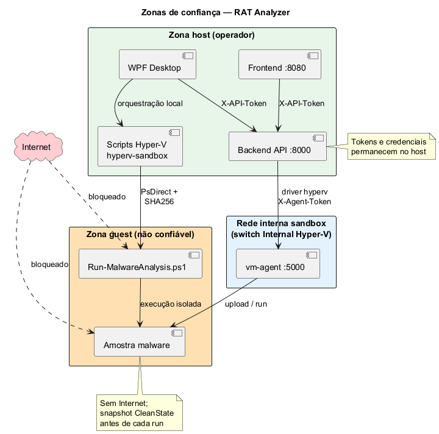
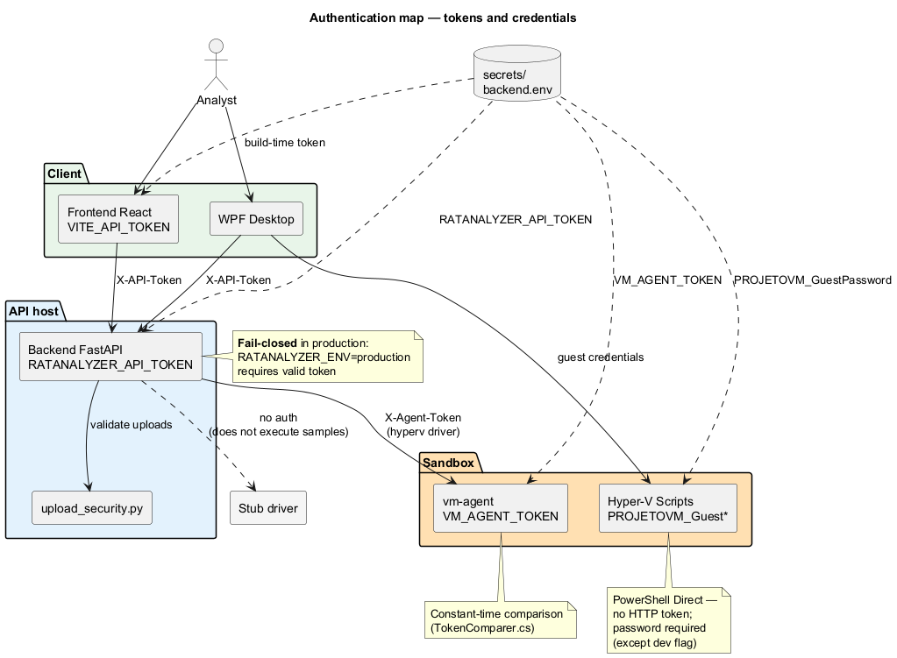

# Arquitetura de segurança

Documento canónico da **estrutura de segurança** do RAT Analyzer. Complementa o guia operacional [`production-secrets.md`](production-secrets.md).

> **Âmbito:** uso local, laboratório ou rede interna controlada. O projeto **não** foi desenhado para exposição pública à Internet sem camadas adicionais (reverse proxy, TLS, firewall, IAM).

---

## Índice

- [Princípios](#princípios)
- [Zonas de confiança](#zonas-de-confiança)
- [Mapa de autenticação](#mapa-de-autenticação)
- [Gestão de segredos](#gestão-de-segredos)
- [Proteção de uploads e dados](#proteção-de-uploads-e-dados)
- [Isolamento da sandbox](#isolamento-da-sandbox)
- [Integridade de dependências](#integridade-de-dependências)
- [Modo desenvolvimento vs produção](#modo-desenvolvimento-vs-produção)
- [Superfícies de ataque e mitigações](#superfícies-de-ataque-e-mitigações)
- [Validação automática (CI)](#validação-automática-ci)
- [Checklist estrutural](#checklist-estrutural)
- [Documentação relacionada](#documentação-relacionada)

---

## Princípios

| Princípio | Implementação no projeto |
|-----------|--------------------------|
| **Fail-closed em produção** | Backend recusa arrancar sem `RATANALYZER_API_TOKEN` quando `RATANALYZER_ENV=production` ou `RATANALYZER_REQUIRE_API_TOKEN=1`. vm-agent termina sem `VM_AGENT_TOKEN`. Scripts Hyper-V recusam password em falta (exceto flag de dev). |
| **Malware isolado** | Amostras executam apenas em VM dedicada (Hyper-V) ou não executam (`stub`). Artefatos em `DATA_DIR` fora do repositório. |
| **Segredos fora do Git** | `secrets/`, `.env`, passwords - gitignored. Geração com `scripts/generate-production-secrets.ps1`. |
| **Bind local por defeito** | API em `127.0.0.1`; vm-agent no IP **interno** da VM (não `0.0.0.0` em produção). |
| **Menor privilégio** | WPF Hyper-V requer Administrador apenas no host; guest com utilizador dedicado (`analyst`). |
| **Defesa em profundidade** | Auth + sanitização de uploads + limites de tamanho + isolamento de rede da VM + snapshot limpo antes de cada run. |

---

## Zonas de confiança



Fonte: [`diagrams/security-trust-zones.puml`](diagrams/security-trust-zones.puml)

| Zona | Componentes | Nível de confiança | Dados sensíveis |
|------|-------------|-------------------|-----------------|
| **Host** | backend, frontend, WPF, scripts | Operador confia | Tokens API, credenciais guest, relatórios |
| **Rede sandbox** | switch Internal Hyper-V | Segmentada, sem Internet na guest | `VM_AGENT_TOKEN` em trânsito |
| **Guest** | VM Windows, amostras | **Não confiável** | Nenhum segredo persistente |

**Regra:** nunca copiar segredos do host para discos partilhados com a guest além do estritamente necessário (`VM_AGENT_TOKEN` no processo do agent, não em ficheiros versionados).

---

## Mapa de autenticação



Fonte: [`diagrams/security-auth-tokens.puml`](diagrams/security-auth-tokens.puml)

| Componente | Mecanismo | Header / canal | Obrigatório em produção |
|------------|-----------|----------------|-------------------------|
| **Backend** | Token estático | `X-API-Token` = `RATANALYZER_API_TOKEN` | Sim (com flags de produção) |
| **Frontend** | Propaga token ao API | Via `VITE_API_TOKEN` no build | Sim (build de produção) |
| **WPF** | Propaga token ao API e ao frontend que arranca | `X-API-Token` + env para uvicorn/Vite | Sim |
| **vm-agent** | Token estático + comparação em tempo constante | `X-Agent-Token` = `VM_AGENT_TOKEN` | Sim |
| **Scripts Hyper-V** | PowerShell Direct | Credenciais `PROJETOVM_GuestUser` / `PROJETOVM_GuestPassword` | Sim |
| **Driver `stub`** | Nenhum (não executa amostras) | - | N/A - seguro por omissão |

Implementação de referência:

- Backend: `backend/security_config.py`, `backend/api.py`
- Uploads: `backend/upload_security.py`
- vm-agent: `vm-agent/Security/AgentTokenMiddleware.cs`, `TokenComparer.cs`
- WPF credenciais: `wpf-gui/Services/VmGuestCredentials.cs`

---

## Gestão de segredos

### Estrutura no repositório

```
PROJETO/
├── secrets/              # gitignored - gerado localmente
│   ├── backend.env
│   ├── frontend.env
│   └── sandbox.env
├── backend/.env.example  # modelo sem valores reais
├── frontend/.env         # gitignored
└── scripts/generate-production-secrets.ps1
```

### Os três segredos principais

| Segredo | Variável | Quem usa |
|---------|----------|----------|
| API | `RATANALYZER_API_TOKEN` | backend, frontend, WPF |
| VM Agent | `VM_AGENT_TOKEN` | vm-agent, backend (driver hyperv) |
| Guest VM | `PROJETOVM_GuestPassword` | scripts Hyper-V, WPF |

Procedimento completo: [`production-secrets.md`](production-secrets.md).

### Rotação e revogação

1. Gerar novos valores com `generate-production-secrets.ps1`.
2. Atualizar `backend/.env`, rebuild do frontend (`VITE_API_TOKEN`), reiniciar vm-agent na VM.
3. Invalidar tokens antigos nos serviços em execução.
4. Confirmar que `secrets/` e `.env` não entram em commits (`git status` limpo).

---

## Proteção de uploads e dados

### Uploads HTTP (backend)

| Controlo | Detalhe | Código |
|----------|---------|--------|
| Autenticação | `X-API-Token` em todos os endpoints de upload e storage | `api.py` |
| Nome de ficheiro | Rejeita `..`, separadores, paths absolutos, letra de unidade | `upload_security.py` |
| Tamanho | `RATANALYZER_MAX_UPLOAD_MB` (default 100 MB) | `upload_security.py` |
| Job ID | Apenas UUID v4 | `upload_security.py` |
| Armazenamento | `DATA_DIR` (%LOCALAPPDATA%\RatAnalyzer ou override) - fora do repo | `config.py` |

### Uploads na VM (vm-agent)

| Controlo | Detalhe | Código |
|----------|---------|--------|
| Auth | `X-Agent-Token` em todas as rotas | `AgentTokenMiddleware.cs` |
| Path traversal | `SampleStorage.TryResolveTargetPath` - destino dentro de `samples/` | `SampleStorage.cs` |
| Tamanho | Máx. 200 MB (`AgentLimits.MaxUploadBytes`) | `AgentLimits.cs` |
| Execução | Timeout configurável, máx. 600 s; stdout/stderr limitados | `SampleRunner.cs` |
| Concorrência | Um run de cada vez (`RunGate`) | `RunGate.cs` |

### Dados que não devem ser versionados

- `reports/`, `decompiled/`, `data/`, `sandbox_jobs/` (runtime)
- `secrets/`, `.env*`
- Amostras de malware reais
- Binários de build (`bin/`, `obj/`, `publish/`)

Ver `.gitignore` na raiz e `backend/config.py`.

---

## Isolamento da sandbox

| Controlo | Caminho A (vm-agent) | Caminho B (PowerShell) |
|----------|----------------------|------------------------|
| Hypervisor | Hyper-V (ou Proxmox experimental) | Hyper-V |
| Rede guest | Switch Internal, **sem Internet** | Idem |
| Estado limpo | Restore snapshot `CleanState` antes do run | Idem |
| Telemetria | Básica (processo, stdout/stderr) | Completa (ficheiros, registry, rede, Sysmon) |
| Transporte de relatório | HTTP JSON | PsDirect / Copy-VMFile + SHA256 |
| Gen VM | Gen1 ou Gen2 | Gen1 ou Gen2 (default setup: Gen1) |

Guias: [`sandbox-hyperv-setup.md`](sandbox-hyperv-setup.md) · [`../scripts/hyperv-sandbox/README.md`](../scripts/hyperv-sandbox/README.md).

Sequências detalhadas: Caminho A · [`fig-4-8`](../relatório/imagens/fig-4-8-sequence-path-a.png) · Caminho B · [`fig-4-9`](../relatório/imagens/fig-4-9-sequence-path-b.png).

**Driver `stub` (default):** não executa ficheiros - adequado para validar pipeline sem risco de execução.

**Driver `proxmox`:** experimental, sem validação CI - **não usar em produção** até haver guia e testes dedicados.

---

## Integridade de dependências

O WPF pode instalar Ghidra, ILSpy, Java e componentes do ADK. Em produção, fixe SHA-256:

| Ferramenta | Variável opcional |
|------------|-------------------|
| ILSpy shim | `RATANALYZER_ILSPY_SHA256` |
| Java | `RATANALYZER_JAVA_EXE_SHA256` |
| ADK instalador | `RATANALYZER_ADK_SETUP_SHA256` |
| Ghidra | Verificação automática via `.sha256` do release GitHub |

Detalhe: [`production-secrets.md` § Integridade](production-secrets.md#integridade-de-dependências-wpf).

Implementação: `wpf-gui/Helpers/DownloadIntegrity.cs` (testado em `RatAnalyzer.Desktop.Tests`).

---

## Modo desenvolvimento vs produção

| Flag | Componente | Produção | Dev local |
|------|------------|----------|-----------|
| `RATANALYZER_ENV=production` | backend | **Usar** | Omitir |
| `RATANALYZER_REQUIRE_API_TOKEN=1` | backend | **Usar** | Opcional |
| `VM_AGENT_ALLOW_INSECURE=1` | vm-agent | **Nunca** | Só localhost/lab |
| `PROJETOVM_ALLOW_INSECURE_DEFAULTS=1` | scripts | **Nunca** | Só smoke test |
| `SANDBOX_VM_DRIVER=stub` | backend | OK se não executar amostras | Default seguro |

---

## Superfícies de ataque e mitigações

| Superfície | Risco | Mitigação estrutural |
|------------|-------|----------------------|
| API FastAPI exposta | Upload/execução de malware; acesso a relatórios | Bind `127.0.0.1`; token obrigatório; CORS restrito (`RATANALYZER_CORS_ORIGINS`) |
| vm-agent na VM | Execução remota de binários | Token obrigatório; bind IP interno; VM isolada |
| Frontend (Gemini) | Exfiltração de código para Google | **Client-side** opcional; chave API do utilizador (`geminiApiKey.ts`); não passa pelo backend |
| PowerShell sandbox | Credenciais guest em logs | Password só via env ou diálogo WPF; sem fallback hardcoded em produção |
| Path traversal em uploads | Escrita fora de `DATA_DIR` / `samples/` | Sanitização em backend e vm-agent |
| Dependências externas | Binários adulterados | Locks com hashes (`requirements*.lock`); SHA-256 opcional no WPF |
| Repositório Git | Commit acidental de segredos | `.gitignore`; `secrets/`; revisão em PR |

---

## Validação automática (CI)

| Área | Testes | Ficheiro CI |
|------|--------|-------------|
| Auth backend | `test_security_config.py`, `test_api.py` | `.github/workflows/ci.yml` |
| Uploads | `test_upload_security.py` | idem |
| vm-agent auth + storage | `VmAgent.Tests` (30 testes xUnit) | idem |
| WPF integridade | `RatAnalyzer.Desktop.Tests` (12 testes) | idem |
| Locks Python | `diff` de `requirements*.lock` + `pip-audit` | idem |
| Segredos no Git | `gitleaks` | job `security` |
| Frontend E2E | Playwright (`e2e/upload.spec.ts`) | job `frontend-e2e` |
| Scripts PS1 | UTF-8 + validação de sintaxe | idem |
| Documentação `.md` | Links internos + ortografia PT | `scripts/ci/check_md_links.py` |

Contagens atuais: **84 pytest · 56 Vitest · 48 xUnit** (ver [`.github/workflows/ci.yml`](../.github/workflows/ci.yml)).

---

## Checklist estrutural

Use antes de cada deploy ou demonstração com amostras reais:

- [ ] [`production-secrets.md` § Checklist](production-secrets.md#checklist-antes-de-deploy) completo
- [ ] Backend em `127.0.0.1` ou atrás de firewall; **não** exposto à WAN
- [ ] `RATANALYZER_API_TOKEN` + `VITE_API_TOKEN` alinhados
- [ ] `VM_AGENT_TOKEN` igual no host e na VM
- [ ] `PROJETOVM_GuestPassword` forte; flags `ALLOW_INSECURE` desativadas
- [ ] VM sem acesso à Internet; snapshot `CleanState` validado
- [ ] `DATA_DIR` e `PROJETOVM_BasePath` em discos com espaço e permissões adequadas
- [ ] Nenhum segredo em `git status` ou histórico recente
- [ ] Driver dinâmico consciente: `stub` (seguro), `hyperv` (prod), **não** `proxmox` sem validação

---

## Documentação relacionada

| Documento | Conteúdo |
|-----------|----------|
| [`production-secrets.md`](production-secrets.md) | Geração, deploy e checklist operacional |
| [`faq.md`](faq.md) | Problemas comuns (401, tokens, vm-agent) |
| [`../backend/README.md`](../backend/README.md) | Endpoints e variáveis do backend |
| [`../vm-agent/README.md`](../vm-agent/README.md) | Segurança do agent na VM |
| [`../wpf-gui/README.md`](../wpf-gui/README.md) | Credenciais guest e tokens WPF |
| [`i18n.md`](i18n.md) | Idiomas PT/EN (sem impacto em isolamento; preferência de UI) |
| [`../README.md`](../README.md#testes-e-ci) | Testes locais e convenções de desenvolvimento |

---

**Manutenção:** alterações de auth, isolamento ou gestão de segredos devem atualizar este ficheiro e os testes associados.
